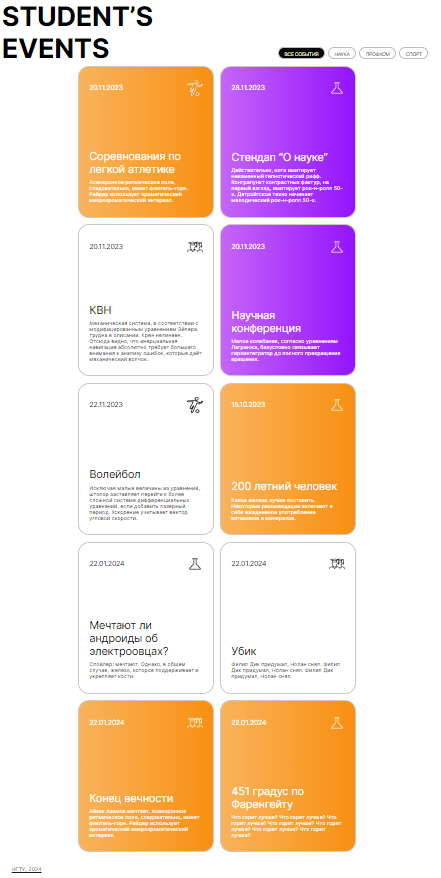
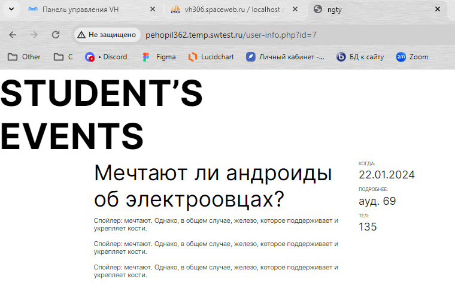

Добавить динамики с помощью базы данных и PHP. Выгрузить из базы данных список всех событий в виде карточек. Для разных типов событий (наука, спорт, профком) устанавливается своя иконка. Важные события подсвечиваются дополнительным цветом (оранжевый, фиолетовый).

При нажатии на карточку (или на заголовок события) происходит переход на внутреннюю страницу с детальным описанием события. При нажатии должен передаваться Get-запрос с id нажатого события.

На внутренней странице детального описания события отображать информацию о событии по переданному в Get-запросе id.

